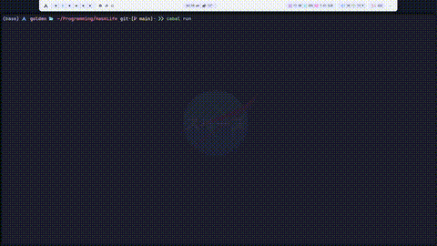

# HaskLife

This is an implementation of Conway's Game of Life in Haskell. It simulates cellular automaton on the terminal with customizable grid size and automatic terminal size adjustments.

## Features:
- Random initial grid generation.
- Dynamic terminal size adjustment.
- Basic rule evolution based on Conway's Game of Life.
- Simple terminal-based rendering.

## How to Run
1. cabal build
2. cabal run

## About the Algorithm
Conway's Game of Life is a zero-player game where cells on a grid evolve based on their neighbors. The rules are:
- Any live cell with fewer than two live neighbors dies (underpopulation).
- Any live cell with two or three live neighbors lives on to the next generation.
- Any live cell with more than three live neighbors dies (overpopulation).
- Any dead cell with exactly three live neighbors becomes a live cell (reproduction).
